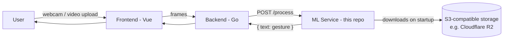
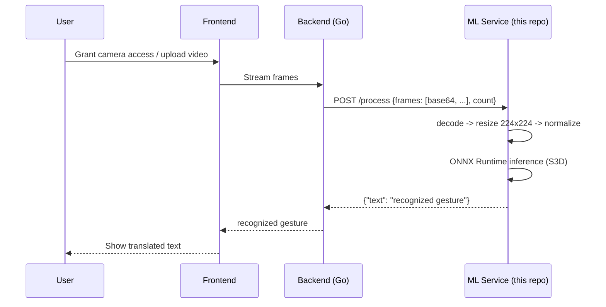
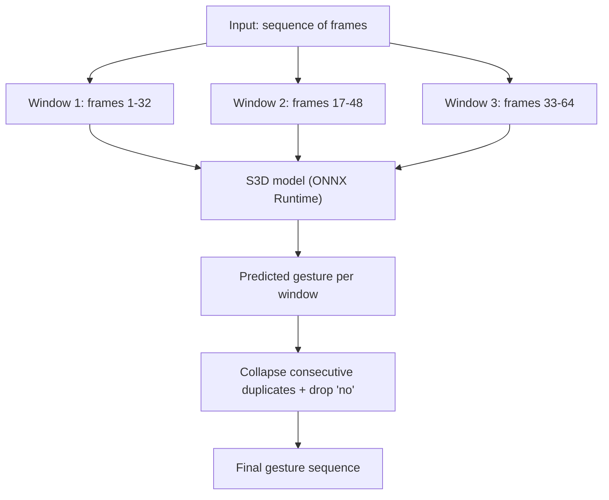

# Sigma Sign — ML Service

**Real-time Russian Sign Language (RSL) recognition, powered by an S3D video classifier exported to ONNX.**

This repository is the ML microservice of **Sigma Sign**, a web application that turns Russian Sign Language into text — either live from a webcam or from an uploaded video — for people who are deaf or hard of hearing. It was built during a 48-hour hackathon and is now looking for research collaborators to push the model, dataset, and grammar-level translation further.

🇷🇺 [Читать на русском](README.ru.md)

[]()
[]()
[]()
[]()

---

## Table of contents

- [What this repo does](#what-this-repo-does)
- [Where it sits in the Sigma Sign stack](#where-it-sits-in-the-sigma-sign-stack)
- [The model](#the-model)
- [Repository structure](#repository-structure)
- [Production API (`app.py`)](#production-api-apppy)
  - [API reference](#api-reference)
  - [Configuration](#configuration)
  - [Quick start](#quick-start)
  - [Docker](#docker)
- [Offline / batch inference (`offline_inference/`)](#offline--batch-inference-offline_inference)
- [Testing](#testing)
  - [Reproducible model evaluation](#reproducible-model-evaluation)
  - [Replay against a deployed stack](#replay-against-a-deployed-stack)
- [Known limitations](#known-limitations)
- [Roadmap & open research questions](#roadmap--open-research-questions)
- [Collaborating with us](#collaborating-with-us)
- [Citation and third-party material](#citation-and-third-party-material)
- [License](#license)

---

## What this repo does

Given a short clip of someone signing (either streamed frame-by-frame from a browser, or a standalone video file), this service:

1. samples/pads the clip to a fixed number of frames,
2. resizes and normalizes them,
3. runs them through an ONNX-exported video classification model,
4. returns the most likely gesture out of ~1,600 Russian Sign Language classes.

It is intentionally **isolated-gesture recognition**, not continuous sign-language translation with grammar — see [Known limitations](#known-limitations) for why that distinction matters and where we'd like to take it next.

## Where it sits in the Sigma Sign stack

Sigma Sign has three repositories under this organization:

| Repo | Stack | Role |
|---|---|---|
| [`frontend`](https://github.com/HSE-SignLanguage/frontend) | Vue | Captures webcam frames / video upload, displays translated text |
| [`backend`](https://github.com/HSE-SignLanguage/backend) | Go | Session/orchestration layer, forwards frames to this ML service |
| **`ml`** (this repo) | Python / FastAPI | Runs model inference, returns recognized gesture text |



Happy path, end to end:



## The model

The production model and label mapping are the exact upstream artifacts from
[ai-forever/easy_sign](https://github.com/ai-forever/easy_sign), not a model
trained or adapted by this project. Easy Sign describes the model as an
S3D (Separable 3D CNN) trained on approximately 180,000 gesture examples,
including approximately 20,000 examples from
[Slovo](https://github.com/hukenovs/slovo), and capable of recognizing 1,598
RSL gestures. The mapping contains 1,599 output entries because it also
contains the `no` class.

Production artifacts are pinned byte-for-byte:

| Artifact | Upstream file | SHA-256 |
| --- | --- | --- |
| S3D ONNX model | [`S3D.onnx`](https://github.com/ai-forever/easy_sign/blob/main/S3D.onnx) | `860ecb5e5aff91b4709016c2dc4f5744eea53e024f80c0b3b8f0f916f6bdb949` |
| Label mapping | [`RSL_class_list.txt`](https://github.com/ai-forever/easy_sign/blob/main/RSL_class_list.txt) | `390e90884aeac96c03ef6db87754ea62cb15b4a5b58f3659a5a900153e97f672` |

Slovo is an important source dataset, but it is not the model's complete
vocabulary. Slovo contains 20,400 videos, 1,001 classes including the
no-event class, and 194 signers. Only 785 of its 999 named glosses match the
production mapping by exact string; spelling and synonym differences account
for part of the mismatch. It would therefore be incorrect to describe all
1,599 output labels as “classes from Slovo”. See the
[Slovo paper](https://arxiv.org/abs/2305.14527) for the dataset protocol.

Each model invocation receives exactly `NUM_FRAMES` frames (32 by default).
The Go backend, rather than this API, creates overlapping windows, stabilizes
live predictions, filters rejected/`no` windows, and builds the transcript.



The model is evaluated by a small deterministic regression sentinel described
below. Its result must not be presented as accuracy on all Slovo data, on the
full Easy Sign vocabulary, or on continuous signing.

## Repository structure

```
ml/
├── app.py                     # Production FastAPI service (used by the Go backend)
├── requirements.txt          # Runtime dependencies
├── requirements-dev.txt      # Tests and local integration tools
├── Dockerfile
├── docker-compose.yml
├── pytest.ini
├── .env.example
├── THIRD_PARTY_NOTICES.md     # Upstream model/data attribution and licenses
├── evaluation/
│   ├── slovo_golden.json      # Pinned 20-video Slovo test subset + checksums
│   ├── evaluate_slovo.py      # Deterministic model regression sentinel
│   └── replay_stack.py        # Upload/WebSocket replay against a full stack
├── tests/
│   └── data/                  # frame.jpg / sample.mp4 fixtures for integration tests
└── offline_inference/         # Standalone inference, no API/backend required
    ├── RSL_class_list.txt      # id -> gesture mapping (1,599 outputs)
    ├── model.py                # Predictor class (loads ONNX model directly, no S3 dependency)
    ├── predict_from_video.py   # CLI: run inference on a local video file end-to-end
    └── configs/
        └── config.json         # model path, class list, threshold, topk, clip_len, provider
```

## Production API (`app.py`)

This is the service the Go backend talks to. On startup it downloads the model and class list from S3-compatible storage (we use Cloudflare R2) if they aren't already present locally, loads them into an ONNX Runtime session, and exposes two endpoints.

### API reference

**`GET /health`**
```
200 OK
"OK"
```

**`POST /process`**

Request:
```json
{
  "frames": ["<base64-encoded image bytes>", "..."],
  "count": 32
}
```
`count` must equal `len(frames)`. Frames are individual images (one per video frame), base64-encoded — this is how the Go backend serializes `[][]byte` over JSON.

Response:
```json
{
  "text": "привет",
  "class_id": 1093,
  "confidence": 0.96,
  "candidates": [{"class_id": 1093, "text": "привет", "confidence": 0.96}],
  "accepted": true,
  "reason": null
}
```

For the `no` class, low confidence, or a small top-1/top-2 margin, the service
returns `accepted: false` with an empty `text`. The backend emits the first
accepted sign immediately, suppresses a held sign until neutral/rejected
windows release it, and requires confirmation before switching directly to a
different accepted class. This reduces transition noise without making the
first translation silent.

Example with `curl` (one static image, repeated — a proper client should send real distinct frames):
```bash
FRAME=$(base64 -i tests/data/frame.jpg)
curl -X POST http://localhost:8085/process \
  -H "Content-Type: application/json" \
  -d "{\"frames\": [$(printf '"%s",' $(yes "$FRAME" | head -32) | sed 's/,$//')], \"count\": 32}"
```

Errors:
- `400` — `count` doesn't match `len(frames)`, or a frame fails to decode.
- `413` — request body exceeds the configured limit.
- `422` — the request does not contain exactly `NUM_FRAMES` frames or violates the schema.
- `503` — the single inference slot is busy; retry later.
- `500` — unexpected internal error (logged server-side).

### Configuration

All configuration is via environment variables (see `.env.example`):

| Variable | Default | Purpose |
|---|---|---|
| `S3_BUCKET` | — | Bucket to download the model/class list from |
| `AWS_REGION` | — | Region for the S3/R2 client |
| `AWS_ACCESS_KEY_ID` / `AWS_SECRET_ACCESS_KEY` | — | Credentials |
| `S3_ENDPOINT_URL` | — | Custom endpoint for S3-compatible storage (e.g. Cloudflare R2) |
| `MODEL_KEY` | `mvit32-2.onnx` | Object key of the model in the bucket; production points it at the pinned `S3D.onnx` object (for example `artifacts/S3D.onnx`) |
| `CLASS_LIST_KEY` | `RSL_class_list.txt` | Object key of the class list; production can use `artifacts/RSL_class_list.txt` |
| `MODEL_PATH` | `artifacts/mvit32-2.onnx` | Local path the model is downloaded to / loaded from; production uses `artifacts/S3D.onnx` |
| `CLASS_LIST_PATH` | `artifacts/RSL_class_list.txt` | Local path for the class list |
| `NUM_FRAMES` | `32` | Frames per inference window |
| `INPUT_SIZE` | `224` | Frame resize target (square) |
| `USE_MOCK` | `false` | If `true`, skips model loading entirely; `/process` always returns `"(Это МОК)"` — useful for frontend/backend dev without the model |
| `FORCE_DOWNLOAD` | `false` | Re-download artifacts on startup even if already present locally |
| `MODEL_SHA256` / `CLASS_LIST_SHA256` | — | Optional SHA-256 checksums for artifact validation |
| `MIN_CONFIDENCE` / `MIN_MARGIN` | `0.5` / `0.1` | Confidence and top-1/top-2 margin thresholds |
| `TOP_K` | `3` | Number of diagnostic candidates returned |
| `NO_GESTURE_LABELS` / `NO_GESTURE_IDS` | `no` / `14` | Labels and ids representing “no gesture” |
| `MAX_FRAME_BYTES` | `524288` | Maximum decoded frame size |
| `MAX_IMAGE_SIDE` / `MAX_IMAGE_PIXELS` | `2048` / `2000000` | Image dimension limits |
| `MAX_REQUEST_BYTES` | derived | Maximum JSON body size, including chunked requests |
| `INFERENCE_WAIT_SECONDS` | `0.25` | Wait for the single inference slot before `503` |
| `ONNX_THREADS` | `2` | ONNX Runtime CPU thread count |
| `HOST` / `PORT` | `0.0.0.0` / `8085` | Uvicorn bind address |
| `RELOAD` | `false` | Uvicorn autoreload (dev only) |
| `DEMO_API_URL` | — | Used by local demo/testing tooling |

For the current production artifact set, pin both the S3 object names and
content checksums (credentials and endpoint omitted):

```dotenv
MODEL_KEY=artifacts/S3D.onnx
CLASS_LIST_KEY=artifacts/RSL_class_list.txt
MODEL_PATH=artifacts/S3D.onnx
CLASS_LIST_PATH=artifacts/RSL_class_list.txt
MODEL_SHA256=860ecb5e5aff91b4709016c2dc4f5744eea53e024f80c0b3b8f0f916f6bdb949
CLASS_LIST_SHA256=390e90884aeac96c03ef6db87754ea62cb15b4a5b58f3659a5a900153e97f672
```


### Quick start

```bash
# 1. Configure
cp .env.example .env   # fill in S3/R2 credentials and the production object keys

# 2. Install (isolated venv)
python -m venv .venv && source .venv/bin/activate
pip install -r requirements-dev.txt

# 3. Run
uvicorn app:app --host 0.0.0.0 --port 8085
```

Prefer to skip the model entirely while working on the frontend/backend? Set `USE_MOCK=true` in `.env` and skip straight to step 3.

### Docker

```bash
cp .env.example .env   # fill in your variables
docker compose up --build
```

`docker-compose.yml` stores the downloaded model and class list in the named
`ml-artifacts` volume so they persist across restarts.
In production, use versioned `MODEL_KEY`/`CLASS_LIST_KEY` values and set both
SHA-256 checksums: replacing an object under the same S3 key cannot otherwise
be detected from the local cache.

## Offline / batch inference (`offline_inference/`)

Sometimes you want to run the model directly against a video file — for evaluation, demos, or debugging — without spinning up the API or the Go backend. That's what this folder is for.

- **`model.py`** — a standalone `Predictor` class. Loads an ONNX model straight from disk (no S3), builds the id→label mapping from a local class list file, and exposes `.predict(frames)` returning top-k labels + confidences (or `None` below `threshold`).
- **`predict_from_video.py`** — reads a video file with OpenCV, resizes frames to 224×224, splits them into sequential (non-overlapping) chunks of `clip_len` frames, runs each chunk through `Predictor`, and prints a de-duplicated gesture sequence.

`configs/config.json` (example):
```json
{
  "model": {
    "path_to_model": "artifacts/s3d.onnx",
    "path_to_class_list": "artifacts/RSL_class_list.txt",
    "provider": "CPUExecutionProvider",
    "threshold": 0.5,
    "topk": 5,
    "clip_len": 32
  }
}
```

Run it:
```bash
cd offline_inference
python predict_from_video.py
```

> **Note:** `VIDEO_PATH` in `predict_from_video.py` is currently a hardcoded absolute path — a good first contribution would be turning it into a CLI argument (`argparse`) so the script is reusable without editing source.

> **Windows note:** on `win32`/`win64`, `model.py` re-encodes the class list from `cp1251` to `utf-8` (a known encoding quirk when the file is read on Windows) and adds OpenVINO execution-provider paths for hardware acceleration. Nothing to configure on Linux/macOS.

**Difference from the production path:** `app.py` processes one already-decoded
window per request; the Go backend creates overlapping windows for live and
uploaded video. `predict_from_video.py` decodes a whole video itself and splits
it into sequential chunks. The model is the same, while the framing strategy
depends on whether inference is live or one-shot.

## Testing

```bash
pip install -r requirements-dev.txt
pytest
```

Fixtures needed in `tests/data/`:
- `frame.jpg` (or `.png`) — any single RGB frame with a hand/gesture visible.
- *(optional, for the video test)* `sample.mp4` — ≥32 frames, standard H.264/mp4.

Tests send (a) 32 copies of `frame.jpg`, and (b) 32 frames evenly sampled from `sample.mp4`/`test.mp4`, and assert both return a non-empty `text` from a running `http://localhost:8085/process`.

### Reproducible model evaluation

The repository contains a fixed 20-video subset of the official Slovo test
split. The manifest pins video IDs, labels, byte sizes and SHA-256 checksums.
The evaluator uses HTTP range requests to fetch only these clips from the
official archive, verifies both upstream model artifacts, creates the same
32/16 frame windows, and invokes the production model normalization and
acceptance code. It intentionally bypasses backend ffmpeg/JPEG/HTTP handling;
the deployed-stack replay below covers that separate boundary.

```bash
python -m evaluation.evaluate_slovo \
  --report .cache/model-evaluation/report.json
```

The recorded baseline for the pinned production artifacts is:

| Regression metric | Result | Required minimum |
| --- | ---: | ---: |
| video top-1 | 0.85 | 0.85 |
| accepted top-1 | 0.85 | 0.85 |
| expected label in top-3 of any window | 0.95 | 0.95 |

This is deliberately a **regression sentinel**, not a representative model
benchmark: 20 selected isolated-gesture videos cannot establish general
accuracy, signer robustness, continuous-signing quality, or coverage of the
1,599-output vocabulary. The thresholds detect any regression on the pinned
raw-model sentinel; they are not a product-quality claim.

### Replay against a deployed stack

After downloading the evaluation fixtures, one clip can be replayed through
both public paths: upload/job polling and paced JPEG frames over WebSocket.
This checks the frontend-facing backend and ML integration, not just ONNX
inference:

```bash
python -m evaluation.replay_stack \
  --base-url https://hack.eferzo.xyz/api \
  --video .cache/model-evaluation/slovo-test/251e3c58-90f9-4ef1-8292-250b76a88aaa.mp4 \
  --mode both \
  --expected день
```

WebSocket replay is strict by default: it waits past the immediate raw gesture
and verifies one complete ordered `gesture -> formatting -> transcript` segment.
It checks the raw expected label in `literal_text`, the authoritative `full_text`
snapshot, and requires the final event to have `enhanced: true`. The explicit
`--allow-raw-websocket` compatibility flag restores the legacy fast-pass for
diagnostics only; do not use it as a production acceptance check.
The compatibility flag is rejected in `--mode upload`, because that mode does
not open a WebSocket.

Use a target you are authorized to test. The command sends real requests and
therefore consumes deployment CPU, upload capacity, and any configured
transcript-cleanup quota.

## Known limitations

Being upfront about these — they're exactly the kind of thing we'd love a research collaboration to help solve:

- **Isolated gestures, not continuous signing.** The model recognizes one gesture per window; it doesn't yet model the grammar, non-manual markers (facial expression, mouth patterns), or co-articulation of continuous RSL sentences.
- **Fixed, closed vocabulary.** The 1,599-output Easy Sign mapping only partly overlaps Slovo; names, neologisms, spelling variants and regional signs can be out of vocabulary or out of distribution.
- **No confidence calibration across window boundaries** — overlapping windows can each fire independently; there's no temporal smoothing/voting beyond simple de-duplication.
- **Single signer framing assumptions** — frames are resized to a fixed square without hand/pose-based cropping, so signer distance/position relative to the camera affects accuracy.
- **A sentinel is not a benchmark.** The pinned 20-video check protects against regressions but does not measure production accuracy or fairness across signers and recording conditions.

## Roadmap & open research questions

- Continuous sign language recognition (sentence-level, not isolated gesture-level).
- Incorporating non-manual markers (facial expression, mouth shape) which carry grammatical meaning in RSL.
- Expanding and documenting the vocabulary with representative, consented data collection.
- Temporal smoothing / voting across overlapping windows instead of simple de-duplication.
- On-device / mobile export (quantization, smaller backbone) for lower-latency inference.
- Formal accuracy/latency benchmarking protocol and public leaderboard.

## Collaborating with us

Sigma Sign started as a hackathon project (December 2025) built to make everyday communication more accessible for the deaf and hard-of-hearing community. We're now looking to partner with researchers working on sign language recognition, continuous gesture translation, or accessibility-focused ML.

If any of the open questions above overlap with your research — reach out. *(contact: email: kuznetsova4ka@gmail.com)*

## Citation and third-party material

When publishing results that use these artifacts, cite both
[Easy Sign](https://github.com/ai-forever/easy_sign) and the
[Slovo paper](https://arxiv.org/abs/2305.14527). The upstream Easy Sign model,
label mapping and Slovo dataset are distributed under
[CC BY-SA 4.0](https://creativecommons.org/licenses/by-sa/4.0/).
Attribution and redistribution notes are collected in
[`THIRD_PARTY_NOTICES.md`](THIRD_PARTY_NOTICES.md).

## License

No repository-wide license has yet been declared for Sigma Sign's own source
code. That does not replace or weaken the licenses of third-party model and
dataset material; consult [`THIRD_PARTY_NOTICES.md`](THIRD_PARTY_NOTICES.md)
before redistributing artifacts or evaluation videos.
