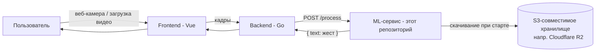
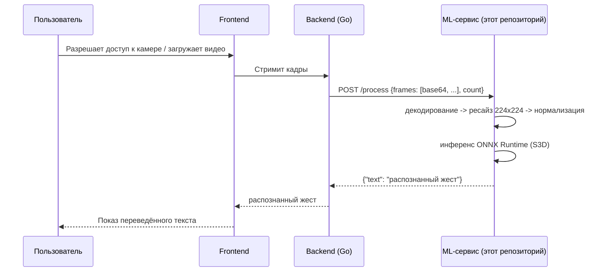
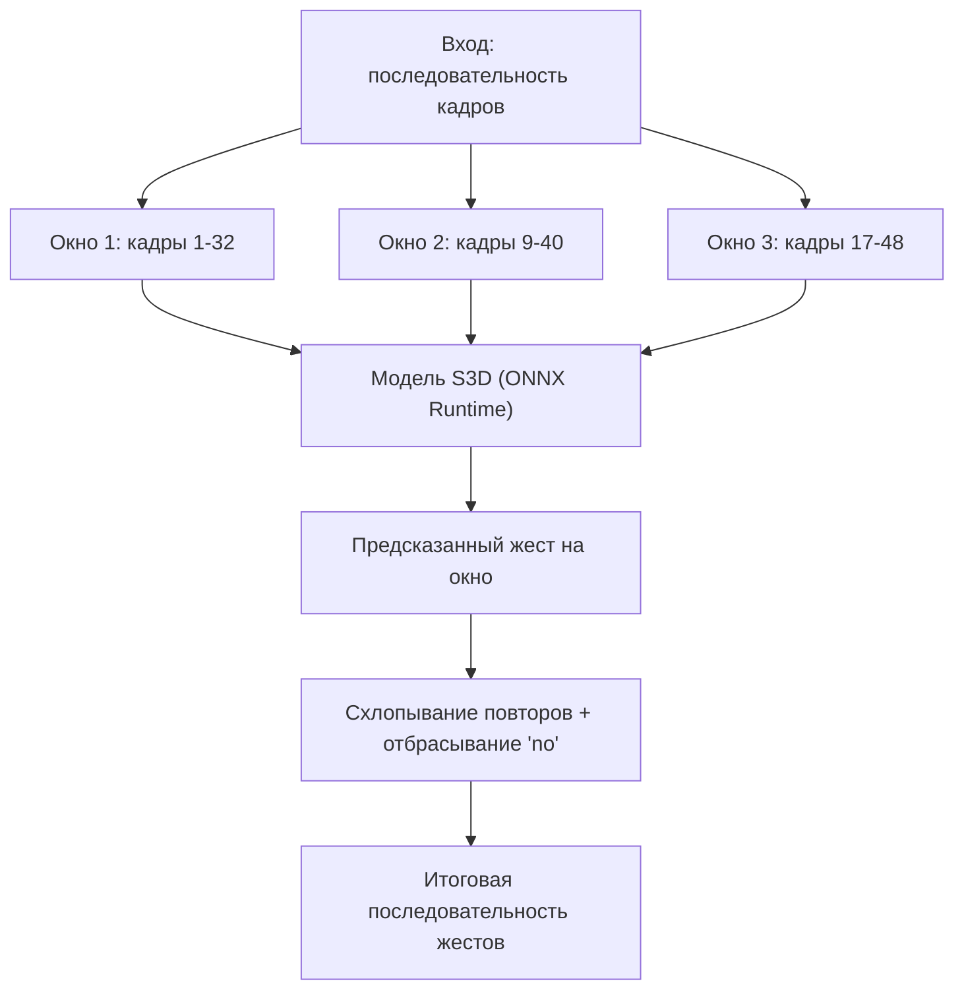

# Sigma Sign — ML-сервис

**Распознавание русского жестового языка (РЖЯ) в реальном времени на видео-трансформере, экспортированном в ONNX.**

Этот репозиторий — ML-микросервис проекта **Sigma Sign**, веб-приложения, которое переводит русский жестовый язык в текст: либо в реальном времени с веб-камеры, либо из загруженного видео. Помогает людям с нарушениями слуха в повседневном общении. Проект родился на 48-часовом хакатоне, и сейчас мы ищем исследовательских партнёров, чтобы развить модель, датасет и перейти от отдельных жестов к переводу с грамматикой.

🇬🇧 [Read in English](README.md)

[]()
[]()
[]()
[]()

---

## Содержание

- [Что делает этот репозиторий](#что-делает-этот-репозиторий)
- [Место в стеке Sigma Sign](#место-в-стеке-sigma-sign)
- [Модель](#модель)
- [Структура репозитория](#структура-репозитория)
- [Продакшн API (`app.py`)](#продакшн-api-apppy)
  - [Справочник API](#справочник-api)
  - [Конфигурация](#конфигурация)
  - [Быстрый старт](#быстрый-старт)
  - [Docker](#docker)
- [Оффлайн / пакетный инференс (`offline_inference/`)](#оффлайн--пакетный-инференс-offline_inference)
- [Тестирование](#тестирование)
- [Известные ограничения](#известные-ограничения)
- [Roadmap и открытые исследовательские вопросы](#roadmap-и-открытые-исследовательские-вопросы)
- [Сотрудничество](#сотрудничество)
- [Цитирование](#цитирование)
- [Лицензия](#лицензия)

---

## Что делает этот репозиторий

По короткому видеофрагменту жестикуляции (переданному покадрово из браузера в реальном времени, либо из отдельного видеофайла) сервис:

1. отбирает/дополняет клип до фиксированного числа кадров,
2. изменяет размер и нормализует их,
3. прогоняет через видео-классификатор, экспортированный в ONNX,
4. возвращает наиболее вероятный жест из ~1600 классов русского жестового языка.

Это осознанно **распознавание отдельных (изолированных) жестов**, а не непрерывный перевод жестового языка с грамматикой — почему это важное различие и куда мы планируем двигаться дальше, смотрите в разделе [Известные ограничения](#известные-ограничения).

## Место в стеке Sigma Sign

У Sigma Sign три репозитория в этой организации:

| Репозиторий | Стек | Роль |
|---|---|---|
| [`frontend`](https://github.com/hackathon-20251207/frontend) | Vue | Захват кадров с камеры / загрузка видео, показ переведённого текста |
| [`backend`](https://github.com/hackathon-20251207/backend) | Go | Слой оркестрации сессий, пересылает кадры в ML-сервис |
| **`ml`** (этот репозиторий) | Python / FastAPI | Запускает инференс модели, возвращает распознанный жест |



Happy path целиком:



## Модель

- **Архитектура:** S3D (Separable 3D CNN), экспортирована в ONNX (`s3d.onnx`).
- **Предобучение:** Kinetics-400 (общее распознавание действий на видео).
- **Дообучение:** [Slovo](https://github.com/hukenovs/slovo) — открытый датасет русского жестового языка — покрывает ~1600 классов жестов, перечисленных в [`RSL_class_list.txt`](./RSL_class_list.txt).
- **Почему не бейзлайн-модель ONNX от Сбера?** Мы протестировали её на раннем этапе и перешли на дообученный чекпоинт S3D, отталкиваясь от двух главных факторов для живого UX: **скорости инференса** и **точности** на нашем целевом словаре. Готовы поделиться заметками сравнения с теми, кто копает ту же дилемму.
- **Стратегия инференса:** скользящее окно из `NUM_FRAMES` (по умолчанию 32) кадров подаётся в модель на каждое предсказание; последовательные повторяющиеся предсказания и класс `no` (жест не распознан) схлопываются в итоговую чистую последовательность.



> **Точность модели:** TODO — сюда пойдут accuracy@top-1, accuracy@top-5 и задержка на окно (CPU/GPU). *(плейсхолдер — Вера дополнит реальными цифрами бенчмарка)*
> **Живое демо:** TODO — ссылка сюда, если/когда деплой будет публично доступен.

## Структура репозитория

```
ml/
├── app.py                     # Продакшн FastAPI-сервис (используется Go-бэкендом)
├── requirements.txt
├── Dockerfile
├── docker-compose.yml
├── pytest.ini
├── .env.example
├── RSL_class_list.txt         # маппинг id -> название жеста (~1600 классов)
├── tests/
│   └── data/                  # frame.jpg / sample.mp4 для интеграционных тестов
└── offline_inference/         # Автономный инференс, без API/бэкенда
    ├── model.py                # Класс Predictor (грузит ONNX-модель напрямую, без S3)
    ├── predict_from_video.py   # CLI: инференс на локальном видеофайле от начала до конца
    └── configs/
        └── config.json         # путь к модели, список классов, threshold, topk, clip_len, provider
```

## Продакшн API (`app.py`)

Это сервис, с которым общается Go-бэкенд. При старте он скачивает модель и список классов из S3-совместимого хранилища (мы используем Cloudflare R2), если их ещё нет локально, загружает их в сессию ONNX Runtime и открывает два эндпоинта.

### Справочник API

**`GET /health`**
```
200 OK
"OK"
```

**`POST /process`**

Запрос:
```json
{
  "frames": ["<base64-encoded изображение>", "..."],
  "count": 32
}
```
`count` должен совпадать с `len(frames)`. Кадры — это отдельные изображения (по одному на кадр видео), закодированные в base64 — так Go-бэкенд сериализует `[][]byte` в JSON.

Ответ:
```json
{ "text": "распознанный жест" }
```

Пример через `curl` (один статичный кадр, повторённый — в реальности клиент должен слать настоящие разные кадры):
```bash
FRAME=$(base64 -i tests/data/frame.jpg)
curl -X POST http://localhost:8085/process \
  -H "Content-Type: application/json" \
  -d "{\"frames\": [$(printf '"%s",' $(yes "$FRAME" | head -32) | sed 's/,$//')], \"count\": 32}"
```

Ошибки:
- `400` — `count` не совпадает с `len(frames)`, либо кадр не декодируется.
- `500` — непредвиденная внутренняя ошибка (логируется на сервере).

### Конфигурация

Вся конфигурация — через переменные окружения (см. `.env.example`):

| Переменная | По умолчанию | Назначение |
|---|---|---|
| `S3_BUCKET` | — | Бакет, откуда скачивать модель/список классов |
| `AWS_REGION` | — | Регион для S3/R2-клиента |
| `AWS_ACCESS_KEY_ID` / `AWS_SECRET_ACCESS_KEY` | — | Учётные данные |
| `S3_ENDPOINT_URL` | — | Кастомный эндпоинт для S3-совместимого хранилища (напр. Cloudflare R2) |
| `MODEL_KEY` | `mvit32-2.onnx` | Ключ объекта модели в бакете |
| `CLASS_LIST_KEY` | `RSL_class_list.txt` | Ключ объекта списка классов в бакете |
| `MODEL_PATH` | `artifacts/mvit32-2.onnx` | Локальный путь, куда модель скачивается / откуда грузится |
| `CLASS_LIST_PATH` | `artifacts/RSL_class_list.txt` | Локальный путь для списка классов |
| `NUM_FRAMES` | `32` | Кадров на окно инференса |
| `INPUT_SIZE` | `224` | Целевой размер кадра при ресайзе (квадрат) |
| `USE_MOCK` | `false` | Если `true` — модель вообще не грузится; `/process` всегда отвечает `"(Это МОК)"` — удобно для разработки фронта/бэка без модели |
| `FORCE_DOWNLOAD` | `false` | Перекачать артефакты при старте, даже если уже есть локально |
| `HOST` / `PORT` | `0.0.0.0` / `8085` | Адрес привязки Uvicorn |
| `RELOAD` | `false` | Автоперезагрузка Uvicorn (только для разработки) |
| `DEMO_API_URL` | — | Используется локальными демо/тестовыми утилитами |

> **⚠️ Важно:** значения по умолчанию в коде (`MODEL_KEY` / `MODEL_PATH`) всё ещё указывают на `mvit32-2.onnx`, но в проде реально работает **S3D** (`s3d.onnx`). Убедитесь, что в `.env` / деплое выставлено `MODEL_KEY=s3d.onnx` (и соответствующий `MODEL_PATH`) — иначе при новом деплое молча подтянется не тот чекпоинт.

### Быстрый старт

```bash
# 1. Настройка
cp .env.example .env   # заполните S3/R2-учётные данные и MODEL_KEY=s3d.onnx

# 2. Установка (изолированно через venv)
python -m venv .venv && source .venv/bin/activate
pip install -r requirements.txt

# 3. Запуск
uvicorn app:app --host 0.0.0.0 --port 8085
```

Хотите вообще пропустить модель, работая над фронтом/бэком? Поставьте `USE_MOCK=true` в `.env` и сразу переходите к шагу 3.

### Docker

```bash
cp .env.example .env   # заполните переменные
docker compose up --build
```

`docker-compose.yml` монтирует `./artifacts` внутрь контейнера, поэтому скачанные модель/список классов сохраняются между перезапусками.

## Оффлайн / пакетный инференс (`offline_inference/`)

Иногда нужно прогнать модель прямо на видеофайле — для оценки, демо или отладки — без поднятия API или Go-бэкенда. Для этого — эта папка.

- **`model.py`** — автономный класс `Predictor`. Грузит ONNX-модель прямо с диска (без S3), строит маппинг id→метка из локального файла списка классов, и предоставляет `.predict(frames)`, возвращающий топ-k меток и уверенностей (или `None`, если ниже `threshold`).
- **`predict_from_video.py`** — читает видеофайл через OpenCV, ресайзит кадры до 224×224, делит их на последовательные (без перекрытия) чанки по `clip_len` кадров, прогоняет каждый чанк через `Predictor` и печатает итоговую последовательность жестов без повторов.

`configs/config.json` (пример):
```json
{
  "model": {
    "path_to_model": "artifacts/s3d.onnx",
    "path_to_class_list": "artifacts/RSL_class_list.txt",
    "provider": "CPUExecutionProvider",
    "threshold": 0.5,
    "topk": 5,
    "clip_len": 32
  }
}
```

Запуск:
```bash
cd offline_inference
python predict_from_video.py
```

> **Примечание:** `VIDEO_PATH` в `predict_from_video.py` сейчас — захардкоженный абсолютный путь. Хороший первый вклад — вынести его в аргумент CLI (`argparse`), чтобы скрипт можно было переиспользовать без правки исходников.

> **Про Windows:** на `win32`/`win64` `model.py` перекодирует список классов из `cp1251` в `utf-8` (известная особенность кодировки при чтении файла на Windows) и добавляет пути OpenVINO execution-provider для аппаратного ускорения. На Linux/macOS настраивать ничего не нужно.

**Отличие от продакшн API:** API (`app.py`) получает уже декодированные кадры, которые Go-бэкенд захватил вживую, и использует перекрывающееся скользящее окно; `predict_from_video.py` сам декодирует целое видео и делит его на последовательные чанки. Модель одна и та же, две разные стратегии нарезки — в зависимости от того, живой это стриминг или разовый пакетный анализ.

## Тестирование

```bash
pip install -r requirements.txt
pytest -m integration
```

Файлы, нужные в `tests/data/`:
- `frame.jpg` (или `.png`) — любой одиночный RGB-кадр с видимой рукой/жестом.
- *(опционально, для видео-теста)* `sample.mp4` — ≥32 кадра, стандартный H.264/mp4.

Тесты отправляют: (а) 32 копии `frame.jpg`; (б) 32 кадра, равномерно выбранных из `sample.mp4`/`test.mp4` — и проверяют, что оба случая возвращают непустой `text` от запущенного `http://localhost:8085/process`.

## Известные ограничения

Говорим прямо — это именно то, в чём исследовательское сотрудничество могло бы реально помочь:

- **Изолированные жесты, а не непрерывная жестикуляция.** Модель распознаёт один жест на окно; пока не моделирует грамматику, немануальные маркеры (мимика, артикуляция ртом) или коартикуляцию непрерывных фраз РЖЯ.
- **Фиксированный, закрытый словарь.** ~1600 классов из Slovo — реальная жестикуляция (имена, неологизмы, региональные варианты) будет выходить за эти рамки.
- **Нет калибровки уверенности между границами окон** — перекрывающиеся окна срабатывают независимо друг от друга; временного сглаживания/голосования сверх простого схлопывания повторов нет.
- **Допущения об одном подписчике в кадре** — кадры ресайзятся до фиксированного квадрата без кропа по руке/позе, поэтому расстояние/положение относительно камеры влияет на точность.
- **Цифры бенчмарка пока не опубликованы** здесь (см. TODO выше) — готовы поделиться по запросу, пока финализируем протокол оценки.

## Roadmap и открытые исследовательские вопросы

- Распознавание непрерывного жестового языка (на уровне предложений, а не отдельных жестов).
- Учёт немануальных маркеров (мимика, форма рта), которые в РЖЯ несут грамматическое значение.
- Расширение словаря за пределы ~1600 классов Slovo за счёт дополнительного сбора данных.
- Временное сглаживание/голосование по перекрывающимся окнам вместо простого схлопывания повторов.
- Экспорт на устройство/мобильный (квантизация, более лёгкий backbone) для меньшей задержки инференса.
- Формальный протокол бенчмарка точности/задержки и публичный лидерборд.

## Сотрудничество

Sigma Sign начинался как хакатон-проект (декабрь 2025), созданный, чтобы сделать повседневное общение доступнее для сообщества людей с нарушениями слуха. Сейчас мы ищем партнёрства с исследователями, работающими над распознаванием жестового языка, непрерывным переводом жестов или accessibility-ориентированным ML.

Если что-то из открытых вопросов выше пересекается с вашими исследованиями — напишите нам. *(контакт: TODO — добавить email или ссылку на форму контакта)*

## Цитирование

Если вы используете этот проект или модель в академической работе, пожалуйста, процитируйте его — файл `CITATION.cff` будет добавлен; пока используйте:

```
Sigma Sign — сервис распознавания русского жестового языка.
Создан на [название хакатона/дата], 2025. TODO: добавить авторов, DOI/URL, когда будут доступны.
```

## Лицензия

TODO — в репозитории пока нет файла лицензии. До его добавления все права по умолчанию защищены; пожалуйста, свяжитесь с нами перед повторным использованием модели или кода.
