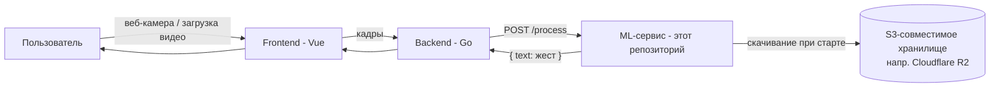
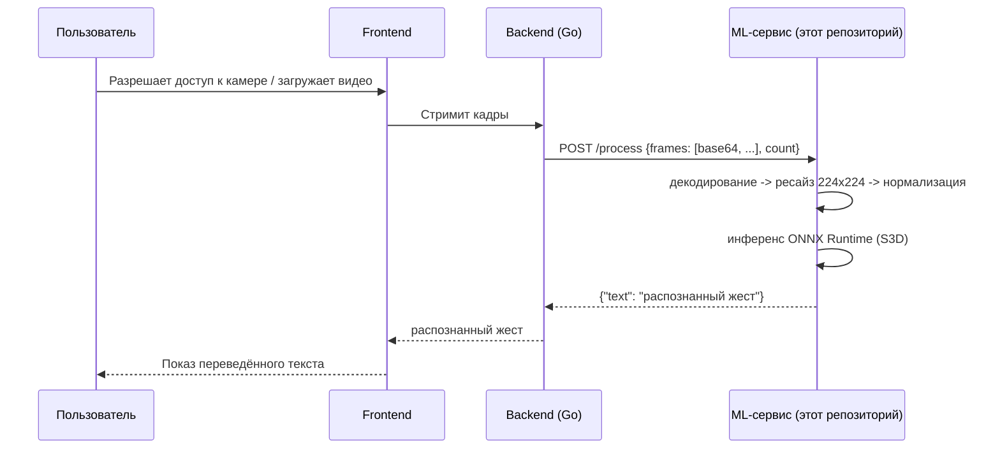
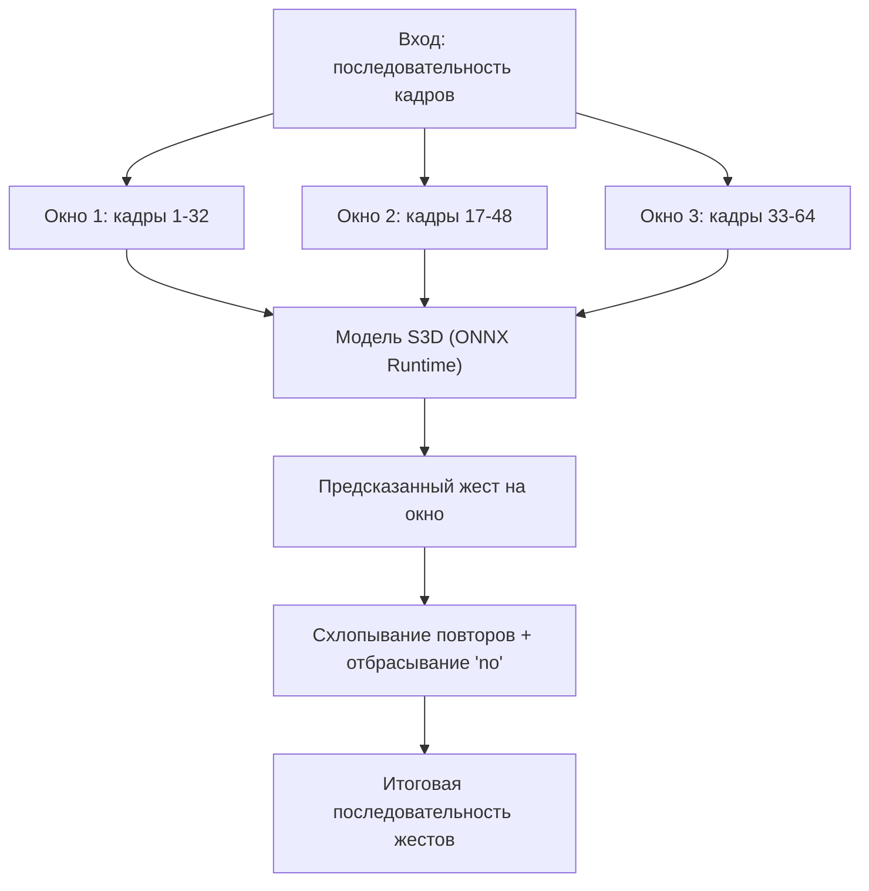

# Sigma Sign — ML-сервис

**Распознавание русского жестового языка (РЖЯ) в реальном времени на S3D-видеоклассификаторе, экспортированном в ONNX.**

Этот репозиторий — ML-микросервис проекта **Sigma Sign**, веб-приложения, которое переводит русский жестовый язык в текст: либо в реальном времени с веб-камеры, либо из загруженного видео. Помогает людям с нарушениями слуха в повседневном общении. Проект родился на 48-часовом хакатоне, и сейчас мы ищем исследовательских партнёров, чтобы развить модель, датасет и перейти от отдельных жестов к переводу с грамматикой.

🇬🇧 [Read in English](README.md)

[]()
[]()
[]()
[]()

---

## Содержание

- [Что делает этот репозиторий](#что-делает-этот-репозиторий)
- [Место в стеке Sigma Sign](#место-в-стеке-sigma-sign)
- [Модель](#модель)
- [Структура репозитория](#структура-репозитория)
- [Продакшн API (`app.py`)](#продакшн-api-apppy)
  - [Справочник API](#справочник-api)
  - [Конфигурация](#конфигурация)
  - [Быстрый старт](#быстрый-старт)
  - [Docker](#docker)
- [Оффлайн / пакетный инференс (`offline_inference/`)](#оффлайн--пакетный-инференс-offline_inference)
- [Тестирование](#тестирование)
  - [Воспроизводимая проверка модели](#воспроизводимая-проверка-модели)
  - [Повтор видео через развёрнутый стек](#повтор-видео-через-развёрнутый-стек)
- [Известные ограничения](#известные-ограничения)
- [Roadmap и открытые исследовательские вопросы](#roadmap-и-открытые-исследовательские-вопросы)
- [Сотрудничество](#сотрудничество)
- [Цитирование и сторонние материалы](#цитирование-и-сторонние-материалы)
- [Лицензия](#лицензия)

---

## Что делает этот репозиторий

По короткому видеофрагменту жестикуляции (переданному покадрово из браузера в реальном времени, либо из отдельного видеофайла) сервис:

1. отбирает/дополняет клип до фиксированного числа кадров,
2. изменяет размер и нормализует их,
3. прогоняет через видео-классификатор, экспортированный в ONNX,
4. возвращает наиболее вероятный жест из ~1600 классов русского жестового языка.

Это осознанно **распознавание отдельных (изолированных) жестов**, а не непрерывный перевод жестового языка с грамматикой — почему это важное различие и куда мы планируем двигаться дальше, смотрите в разделе [Известные ограничения](#известные-ограничения).

## Место в стеке Sigma Sign

У Sigma Sign три репозитория в этой организации:

| Репозиторий | Стек | Роль |
|---|---|---|
| [`frontend`](https://github.com/HSE-SignLanguage/frontend) | Vue | Захват кадров с камеры / загрузка видео, показ переведённого текста |
| [`backend`](https://github.com/HSE-SignLanguage/backend) | Go | Слой оркестрации сессий, пересылает кадры в ML-сервис |
| **`ml`** (этот репозиторий) | Python / FastAPI | Запускает инференс модели, возвращает распознанный жест |



Happy path целиком:



## Модель

Продакшн-модель и таблица меток — точные upstream-артефакты
[ai-forever/easy_sign](https://github.com/ai-forever/easy_sign), а не модель,
обученная или адаптированная в этом проекте. Easy Sign описывает
её как S3D (Separable 3D CNN), обученную примерно на 180 000
примерах жестов. Около 20 000 из них взяты из
[Slovo](https://github.com/hukenovs/slovo). По данным upstream, модель
распознаёт 1598 жестов РЖЯ; в таблице 1599 выходов, потому что
в ней есть ещё класс `no`.

Продакшн-артефакты зафиксированы побайтово:

| Артефакт | Upstream-файл | SHA-256 |
| --- | --- | --- |
| S3D ONNX | [`S3D.onnx`](https://github.com/ai-forever/easy_sign/blob/main/S3D.onnx) | `860ecb5e5aff91b4709016c2dc4f5744eea53e024f80c0b3b8f0f916f6bdb949` |
| Таблица меток | [`RSL_class_list.txt`](https://github.com/ai-forever/easy_sign/blob/main/RSL_class_list.txt) | `390e90884aeac96c03ef6db87754ea62cb15b4a5b58f3659a5a900153e97f672` |

Slovo — важная часть обучающих данных, но не весь словарь модели.
В Slovo 20 400 видео, 1001 класс с учётом no-event и 194 жестовика.
Из 999 именованных глосс только 785 совпадают с продакшн-словарём
по точной строке; часть расхождений вызвана синонимами и написанием.
Поэтому нельзя утверждать, что все 1599 выходов — «классы из Slovo».
Протокол датасета описан в [статье Slovo](https://arxiv.org/abs/2305.14527).

Каждый вызов модели получает ровно `NUM_FRAMES` кадров (по умолчанию 32).
Перекрывающиеся окна формирует, живые предсказания стабилизирует, а
отклонённые/`no`-окна фильтрует Go-бэкенд, а не это API.



Модель проверяется на малом детерминированном regression sentinel,
описанном ниже. Его результат нельзя выдавать за точность на всём
Slovo, на полном словаре Easy Sign или на непрерывной жестикуляции.

## Структура репозитория

```
ml/
├── app.py                     # Продакшн FastAPI-сервис (используется Go-бэкендом)
├── requirements.txt          # Runtime-зависимости
├── requirements-dev.txt      # Тесты и локальные integration-инструменты
├── Dockerfile
├── docker-compose.yml
├── pytest.ini
├── .env.example
├── THIRD_PARTY_NOTICES.md     # Атрибуция и лицензии upstream-модели/данных
├── evaluation/
│   ├── slovo_golden.json      # Фиксированные 20 Slovo-видео и checksum
│   ├── evaluate_slovo.py      # Детерминированный regression sentinel
│   └── replay_stack.py        # Повтор upload/WebSocket через весь стек
├── tests/
│   └── data/                  # frame.jpg / sample.mp4 для интеграционных тестов
└── offline_inference/         # Автономный инференс, без API/бэкенда
    ├── RSL_class_list.txt      # Маппинг id -> жест (1599 выходов)
    ├── model.py                # Класс Predictor (грузит ONNX-модель напрямую, без S3)
    ├── predict_from_video.py   # CLI: инференс на локальном видеофайле от начала до конца
    └── configs/
        └── config.json         # путь к модели, список классов, threshold, topk, clip_len, provider
```

## Продакшн API (`app.py`)

Это сервис, с которым общается Go-бэкенд. При старте он скачивает модель и список классов из S3-совместимого хранилища (мы используем Cloudflare R2), если их ещё нет локально, загружает их в сессию ONNX Runtime и открывает два эндпоинта.

### Справочник API

**`GET /health`**
```
200 OK
"OK"
```

**`POST /process`**

Запрос:
```json
{
  "frames": ["<base64-encoded изображение>", "..."],
  "count": 32
}
```
`count` должен совпадать с `len(frames)`. Кадры — это отдельные изображения (по одному на кадр видео), закодированные в base64 — так Go-бэкенд сериализует `[][]byte` в JSON.

Ответ:
```json
{
  "text": "привет",
  "class_id": 1093,
  "confidence": 0.96,
  "candidates": [{"class_id": 1093, "text": "привет", "confidence": 0.96}],
  "accepted": true,
  "reason": null
}
```

Для класса `no`, низкой уверенности или малого отрыва top-1 от top-2 сервис
возвращает `accepted: false` и пустой `text`. Backend сразу выводит первый
принятый жест, подавляет удерживаемый жест до нейтральных/отклонённых окон
и требует подтверждения при прямом переходе к другому принятому классу. Так
переходный шум снижается, но первый перевод не пропадает.

Пример через `curl` (один статичный кадр, повторённый — в реальности клиент должен слать настоящие разные кадры):
```bash
FRAME=$(base64 -i tests/data/frame.jpg)
curl -X POST http://localhost:8085/process \
  -H "Content-Type: application/json" \
  -d "{\"frames\": [$(printf '"%s",' $(yes "$FRAME" | head -32) | sed 's/,$//')], \"count\": 32}"
```

Ошибки:
- `400` — `count` не совпадает с `len(frames)`, либо кадр не декодируется.
- `413` — тело запроса превышает настроенный лимит.
- `422` — отправлено не ровно `NUM_FRAMES` кадров или нарушена схема.
- `503` — inference slot занят; запрос можно повторить позже.
- `500` — непредвиденная внутренняя ошибка (логируется на сервере).

### Конфигурация

Вся конфигурация — через переменные окружения (см. `.env.example`):

| Переменная | По умолчанию | Назначение |
|---|---|---|
| `S3_BUCKET` | — | Бакет, откуда скачивать модель/список классов |
| `AWS_REGION` | — | Регион для S3/R2-клиента |
| `AWS_ACCESS_KEY_ID` / `AWS_SECRET_ACCESS_KEY` | — | Учётные данные |
| `S3_ENDPOINT_URL` | — | Кастомный эндпоинт для S3-совместимого хранилища (напр. Cloudflare R2) |
| `MODEL_KEY` | `mvit32-2.onnx` | Ключ объекта модели; production указывает на зафиксированный `S3D.onnx` (например `artifacts/S3D.onnx`) |
| `CLASS_LIST_KEY` | `RSL_class_list.txt` | Ключ объекта списка классов; production может использовать `artifacts/RSL_class_list.txt` |
| `MODEL_PATH` | `artifacts/mvit32-2.onnx` | Локальный путь к модели; production использует `artifacts/S3D.onnx` |
| `CLASS_LIST_PATH` | `artifacts/RSL_class_list.txt` | Локальный путь для списка классов |
| `NUM_FRAMES` | `32` | Кадров на окно инференса |
| `INPUT_SIZE` | `224` | Целевой размер кадра при ресайзе (квадрат) |
| `USE_MOCK` | `false` | Если `true` — модель вообще не грузится; `/process` всегда отвечает `"(Это МОК)"` — удобно для разработки фронта/бэка без модели |
| `FORCE_DOWNLOAD` | `false` | Перекачать артефакты при старте, даже если уже есть локально |
| `MODEL_SHA256` / `CLASS_LIST_SHA256` | — | Необязательные SHA-256 для проверки артефактов |
| `MIN_CONFIDENCE` / `MIN_MARGIN` | `0.5` / `0.1` | Порог уверенности и отрыв top-1 от top-2 |
| `TOP_K` | `3` | Число диагностических кандидатов в ответе |
| `NO_GESTURE_LABELS` / `NO_GESTURE_IDS` | `no` / `14` | Метки и id класса «нет жеста» |
| `MAX_FRAME_BYTES` | `524288` | Максимальный декодированный размер кадра |
| `MAX_IMAGE_SIDE` / `MAX_IMAGE_PIXELS` | `2048` / `2000000` | Ограничения размера изображения |
| `MAX_REQUEST_BYTES` | вычисляется | Максимальный размер JSON-тела, включая chunked-запросы |
| `INFERENCE_WAIT_SECONDS` | `0.25` | Ожидание единственного inference slot до ответа `503` |
| `ONNX_THREADS` | `2` | Число CPU-потоков ONNX Runtime |
| `HOST` / `PORT` | `0.0.0.0` / `8085` | Адрес привязки Uvicorn |
| `RELOAD` | `false` | Автоперезагрузка Uvicorn (только для разработки) |
| `DEMO_API_URL` | — | Используется локальными демо/тестовыми утилитами |

Для текущего production-набора зафиксируйте и имена S3-объектов,
и checksum содержимого (без credentials и endpoint):

```dotenv
MODEL_KEY=artifacts/S3D.onnx
CLASS_LIST_KEY=artifacts/RSL_class_list.txt
MODEL_PATH=artifacts/S3D.onnx
CLASS_LIST_PATH=artifacts/RSL_class_list.txt
MODEL_SHA256=860ecb5e5aff91b4709016c2dc4f5744eea53e024f80c0b3b8f0f916f6bdb949
CLASS_LIST_SHA256=390e90884aeac96c03ef6db87754ea62cb15b4a5b58f3659a5a900153e97f672
```


### Быстрый старт

```bash
# 1. Настройка
cp .env.example .env   # заполните S3/R2-учётные данные и production object keys

# 2. Установка (изолированно через venv)
python -m venv .venv && source .venv/bin/activate
pip install -r requirements-dev.txt

# 3. Запуск
uvicorn app:app --host 0.0.0.0 --port 8085
```


### Docker

```bash
cp .env.example .env   # заполните переменные
docker compose up --build
```

`docker-compose.yml` хранит скачанные модель и список классов в именованном
томе `ml-artifacts`, поэтому они сохраняются между перезапусками.
Для production используйте versioned `MODEL_KEY`/`CLASS_LIST_KEY` и заполните
оба SHA-256: один и тот же ключ S3 без checksum не позволяет обнаружить замену
объекта на стороне хранилища.

## Оффлайн / пакетный инференс (`offline_inference/`)

Иногда нужно прогнать модель прямо на видеофайле — для оценки, демо или отладки — без поднятия API или Go-бэкенда. Для этого — эта папка.

- **`model.py`** — автономный класс `Predictor`. Грузит ONNX-модель прямо с диска (без S3), строит маппинг id→метка из локального файла списка классов, и предоставляет `.predict(frames)`, возвращающий топ-k меток и уверенностей (или `None`, если ниже `threshold`).
- **`predict_from_video.py`** — читает видеофайл через OpenCV, ресайзит кадры до 224×224, делит их на последовательные (без перекрытия) чанки по `clip_len` кадров, прогоняет каждый чанк через `Predictor` и печатает итоговую последовательность жестов без повторов.

`configs/config.json` (пример):
```json
{
  "model": {
    "path_to_model": "artifacts/s3d.onnx",
    "path_to_class_list": "artifacts/RSL_class_list.txt",
    "provider": "CPUExecutionProvider",
    "threshold": 0.5,
    "topk": 5,
    "clip_len": 32
  }
}
```

Запуск:
```bash
cd offline_inference
python predict_from_video.py
```

**Отличие от production path:** `app.py` обрабатывает одно уже
декодированное окно за запрос, а перекрывающиеся окна для живого
и загруженного видео формирует Go-бэкенд. `predict_from_video.py` сам
декодирует всё видео и делит его на последовательные чанки. Модель одна,
а стратегия нарезки зависит от режима инференса.

## Тестирование

```bash
pip install -r requirements-dev.txt
pytest
```

Файлы, нужные в `tests/data/`:
- `frame.jpg` (или `.png`) — любой одиночный RGB-кадр с видимой рукой/жестом.
- *(опционально, для видео-теста)* `sample.mp4` — ≥32 кадра, стандартный H.264/mp4.

Тесты отправляют: (а) 32 копии `frame.jpg`; (б) 32 кадра, равномерно выбранных из `sample.mp4`/`test.mp4` — и проверяют, что оба случая возвращают непустой `text` от запущенного `http://localhost:8085/process`.

### Воспроизводимая проверка модели

В репозитории есть фиксированная подвыборка из 20 роликов официального
test split Slovo. Манифест фиксирует id, метки, размеры и SHA-256.
Утилита через HTTP Range загружает только эти ролики из официального
архива, проверяет оба upstream-артефакта, создаёт те же окна 32/16 и вызывает
production-код нормализации и acceptance модели. Обработка ffmpeg/JPEG/HTTP
на бэкенде намеренно обходится; эту отдельную границу проверяет replay
развёрнутого стека ниже.

```bash
python -m evaluation.evaluate_slovo \
  --report .cache/model-evaluation/report.json
```

Baseline для зафиксированных production-артефактов:

| Regression-метрика | Результат | Минимум |
| --- | ---: | ---: |
| video top-1 | 0.85 | 0.85 |
| accepted top-1 | 0.85 | 0.85 |
| ожидаемая метка в top-3 хотя бы одного окна | 0.95 | 0.95 |

Это именно **regression sentinel**, а не репрезентативный бенчмарк. 20 отобранных
видео изолированных жестов не измеряют общую точность, устойчивость к разным
жестовикам, качество непрерывной жестикуляции или весь словарь из 1599 выходов.
Пороги ловят любую регрессию на зафиксированном raw-model sentinel.

### Повтор видео через развёрнутый стек

После загрузки evaluation fixtures один ролик можно прогнать по обоим публичным
путям: upload с job polling и JPEG-кадры в реальном темпе по WebSocket. Так проверяется
интеграция фронтового контракта, бэкенда и ML, а не только ONNX-инференс:

```bash
python -m evaluation.replay_stack \
  --base-url https://hack.eferzo.xyz/api \
  --video .cache/model-evaluation/slovo-test/251e3c58-90f9-4ef1-8292-250b76a88aaa.mp4 \
  --mode both \
  --expected день
```

WebSocket replay теперь строгий по умолчанию: он не завершается на первом сыром
жесте, а дожидается полного упорядоченного сегмента
`gesture -> formatting -> transcript`. Проверяются ожидаемая исходная метка в
`literal_text`, итоговый снапшот-источник истины `full_text` и `enhanced: true`.
Явный compatibility-флаг `--allow-raw-websocket` возвращает прежний быстрый
режим только для диагностики; его нельзя использовать как production acceptance
check. В режиме `--mode upload` compatibility-флаг отклоняется, поскольку
WebSocket не открывается.

Запускайте только против системы, которую вы имеете право тестировать. Команда
посылает реальные запросы, поэтому расходует CPU, upload capacity и лимиты внешнего
сервиса очистки текста, если он включён.

## Известные ограничения

То, в чём исследовательское сотрудничество могло бы реально помочь:

- **Изолированные жесты, а не непрерывная жестикуляция.** Модель распознаёт один жест на окно; пока не моделирует грамматику, немануальные маркеры (мимика, артикуляция ртом) или коартикуляцию непрерывных фраз РЖЯ.
- **Фиксированный, закрытый словарь.** 1599 выходов Easy Sign лишь частично пересекаются с Slovo; имена, неологизмы, варианты написания и региональные жесты могут быть вне словаря или распределения.
- **Нет калибровки уверенности между границами окон** — перекрывающиеся окна срабатывают независимо друг от друга; временного сглаживания/голосования сверх простого схлопывания повторов нет.
- **Допущения об одном подписчике в кадре** — кадры ресайзятся до фиксированного квадрата без кропа по руке/позе, поэтому расстояние/положение относительно камеры влияет на точность.
- **Sentinel — не бенчмарк.** Фиксированная проверка на 20 видео защищает от регрессий, но не измеряет production-точность или справедливость для разных жестовиков и условий съёмки.

## Roadmap и открытые исследовательские вопросы

- Распознавание непрерывного жестового языка (на уровне предложений, а не отдельных жестов).
- Учёт немануальных маркеров (мимика, форма рта), которые в РЖЯ несут грамматическое значение.
- Расширение и документирование словаря на репрезентативных данных, собранных с согласием участников.
- Временное сглаживание/голосование по перекрывающимся окнам вместо простого схлопывания повторов.
- Экспорт на устройство/мобильный (квантизация, более лёгкий backbone) для меньшей задержки инференса.
- Формальный протокол бенчмарка точности/задержки и публичный лидерборд.

## Сотрудничество

Sigma Sign начинался как хакатон-проект (декабрь 2025), созданный, чтобы сделать повседневное общение доступнее для сообщества людей с нарушениями слуха. Сейчас мы ищем партнёрства с исследователями, работающими над распознаванием жестового языка, непрерывным переводом жестов или accessibility-oriented ML.

Если что-то из открытых вопросов выше пересекается с вашими исследованиями — напишите нам. *(контакт: email: kuznetsova4ka@gmail.com)*

## Цитирование и сторонние материалы

При публикации результатов с этими артефактами укажите и
[Easy Sign](https://github.com/ai-forever/easy_sign), и
[статью Slovo](https://arxiv.org/abs/2305.14527). Upstream-модель Easy Sign,
таблица меток и датасет Slovo распространяются по
[CC BY-SA 4.0](https://creativecommons.org/licenses/by-sa/4.0/).
Атрибуция и заметки о перераспространении собраны в
[`THIRD_PARTY_NOTICES.md`](THIRD_PARTY_NOTICES.md).

## Лицензия

Единая лицензия на собственный исходный код Sigma Sign пока не объявлена.
Это не заменяет и не ослабляет лицензии сторонних моделей и датасетов:
перед перераспространением артефактов или evaluation-видео прочитайте
[`THIRD_PARTY_NOTICES.md`](THIRD_PARTY_NOTICES.md).
